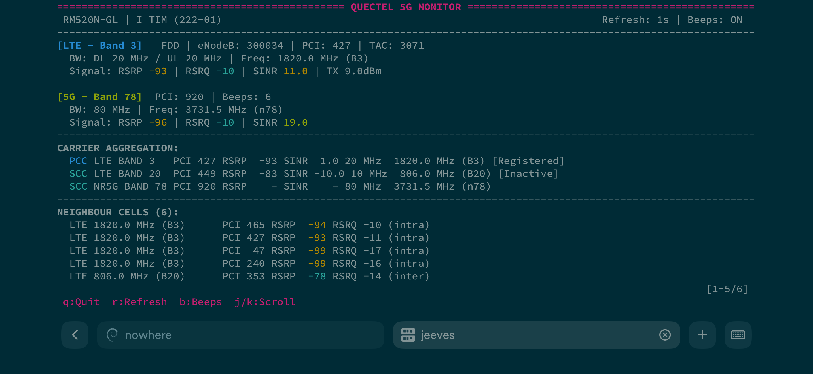
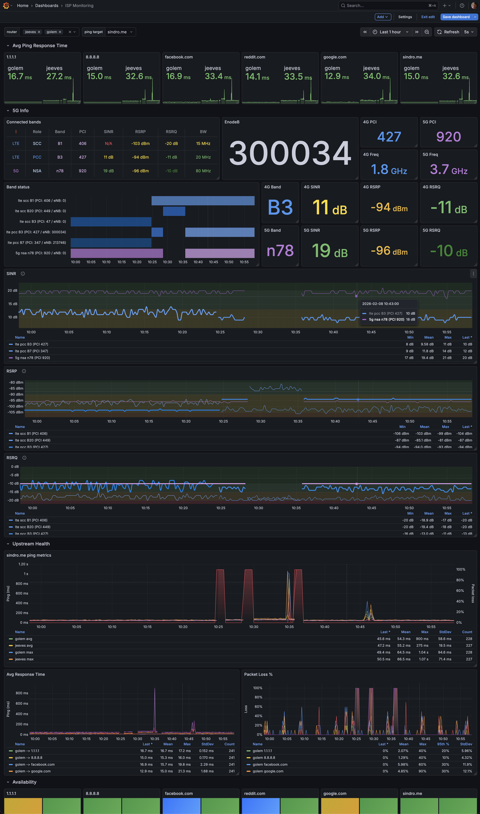

# quectel-5g-tools

Tools for monitoring and configuring Quectel 5G modems on OpenWRT.

Originally developed for the GL.INET X-3000 with Quectel RM520N-GL modem and Poynting XPOL-24 directional antenna.

## Features

- **5g-info**: CLI tool for displaying modem information (table and JSON output)
- **5g-monitor**: Real-time TUI monitor with color-coded signal quality and audio feedback
- **Prometheus exporter**: Metrics for Grafana dashboards
- **at**: Simple AT command wrapper
- **5g-lock**: Band and cell locking utility

## Quick Start

Install dependencies on OpenWRT:

```bash
opkg install luaposix
```

Clone the repo, symlink and run directly:

```bash
git clone https://github.com/vjt/quectel-5g-tools.git
cd quectel-5g-tools
ln -s "$PWD/lua/quectel" /usr/lib/lua/quectel
./bin/5g-info
```


```bash
./bin/5g-monitor
```



Hear it beep!

## Installation

This is still manual - once I'm gonna upstream it then an easy peasy opkg install will be available.

### On the router

```bash
# Install Lua library
rm -f /usr/lib/lua/quectel
cp -r lua/quectel /usr/lib/lua/

# Install CLI tools
cp bin/5g-info bin/5g-monitor bin/at bin/5g-lock /usr/bin/

# Install Prometheus collector (optional)
cp lua/prometheus-collectors/quectel.lua /usr/lib/lua/prometheus-collectors/

# Install UCI config
cp config/quectel.uci /etc/config/quectel
```

A ready to use Grafana dashboard (provided you have already set up metrics exporting to prometheus or victoriametrics) is [available here](https://grafana.com/grafana/dashboards/24835) (ID `24835`).

Obligatory screenshot:



## Usage

### 5g-info

Display modem information:

```bash
5g-info                    # Full info with colors
5g-info --json             # JSON output
5g-info --section serving  # Only serving cell
5g-info --no-color         # Plain text
```

### 5g-monitor

Real-time monitoring with ANSI TUI:

```bash
5g-monitor                 # Start monitor
5g-monitor --interval 2    # 2-second refresh
5g-monitor --no-beep       # Disable audio feedback
```

Press Ctrl+C to quit.

### Band and cell locking

Configure bands in UCI:

```bash
uci add_list quectel.modem.lte_bands='1'
uci add_list quectel.modem.lte_bands='3'
uci add_list quectel.modem.nr5g_bands='78'
uci commit quectel
```

Configure cell locks (optional, does not persist across reboots):

```bash
uci add_list quectel.modem.lte_cells='275,280'       # earfcn,pci
uci add_list quectel.modem.nr5g_cells='920,648768,15,78'  # pci,arfcn,scs,band
uci commit quectel
```

Then apply:

```bash
5g-lock                    # Show current lock status
5g-lock --apply            # Apply bands and cell locks from UCI config
5g-lock --reset            # Clear all band and cell locks
5g-lock --wait=30 --apply  # Wait 30s then apply (for boot scripts)
```

The `--apply` command is declarative: it makes the modem match the UCI config exactly. Bands or cell locks removed from the config will be cleared on the modem. Band locks persist across reboots; cell locks do not.

### AT commands

```bash
at                          # Run default info commands
at ATI                      # Single command
at AT+CSQ 'AT+CREG?'        # Multiple commands
```

## Prometheus Metrics

Install the collector to `/usr/lib/lua/prometheus-collectors/quectel.lua` and it will be picked up by `prometheus-node-exporter-lua`.

Exported metrics:

| Metric | Labels | Description |
|--------|--------|-------------|
| modem_cell_state | role, technology, band, pci, enodeb, cell_id | Connected cells (1=active) |
| modem_signal_rsrp_dbm | role, technology, band, pci | Signal strength |
| modem_signal_rsrq_db | role, technology, band, pci | Signal quality |
| modem_signal_sinr_db | role, technology, band, pci | SINR |
| modem_frequency_mhz | role, technology, band, pci | Carrier frequency |
| modem_bandwidth_mhz | role, technology, band, pci, direction | Bandwidth |

Label values:
- `role`: `pcc` (primary), `scc` (secondary), `nsa` (5G non-standalone)
- `technology`: `lte` or `5g`
- `band`: e.g., `B1`, `B3`, `n78`
- `direction`: `dl` (downlink) or `ul` (uplink)

## Configuration

UCI config: `/etc/config/quectel`

```
config modem 'modem'
    option device '/dev/ttyUSB2'
    option timeout '2'
    option refresh_interval '5'
    option beeps_enabled '1'
    list lte_bands '1'
    list lte_bands '3'
    list lte_bands '7'
    list lte_bands '20'
    list nr5g_bands '78'
    # Cell locks (optional, do not persist across reboots)
    # list lte_cells '275,280'            # earfcn,pci
    # list nr5g_cells '920,648768,15,78'  # pci,arfcn,scs,band
```

## Signal Quality Thresholds

| Metric | Excellent | Good | Fair | Poor |
|--------|-----------|------|------|------|
| RSRP   | > -80 dBm | > -90 dBm | > -100 dBm | < -100 dBm |
| RSRQ   | > -10 dB  | > -12 dB  | > -15 dB   | < -15 dB   |
| SINR   | > 20 dB   | > 13 dB   | > 0 dB     | < 0 dB     |

## Project Structure

```
gl-x3000/
├── lua/
│   ├── quectel/                    # Core Lua library
│   │   ├── init.lua                # Main API and config loading
│   │   ├── modem.lua               # Serial communication
│   │   ├── parser.lua              # AT response parsing
│   │   ├── display.lua             # Terminal output formatting
│   │   ├── frequency.lua           # EARFCN/ARFCN to MHz conversion
│   │   ├── thresholds.lua          # Signal quality thresholds
│   │   └── utils.lua               # Shared utilities
│   └── prometheus-collectors/
│       └── quectel.lua             # Prometheus exporter
├── bin/                            # CLI tools
│   ├── 5g-info                     # One-shot info display
│   ├── 5g-monitor                  # Real-time TUI monitor
│   ├── at                          # AT command wrapper
│   ├── 5g-lock                      # Band and cell locking utility
│   └── modem-debug                 # Debug info collection
├── tests/                          # Test scripts
├── config/
│   └── quectel.uci                 # UCI config template
├── doc/                            # Screenshots
├── openwrt/                        # OpenWRT package Makefile
└── legacy/                         # Python implementation (archived)
```

## Dependencies

- **luaposix**: Required for serial I/O
- **prometheus-node-exporter-lua**: Optional, for Prometheus metrics

## License

MIT
