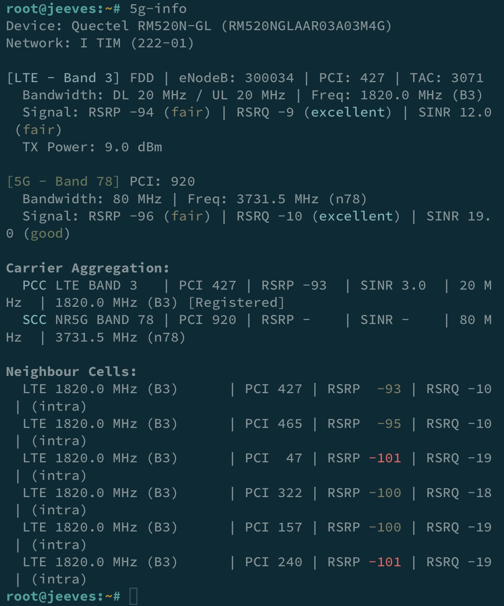
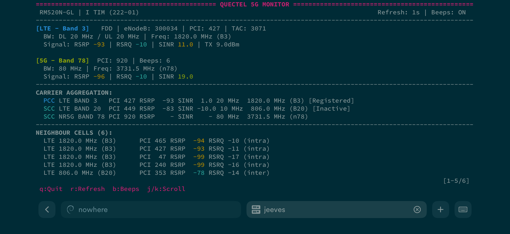
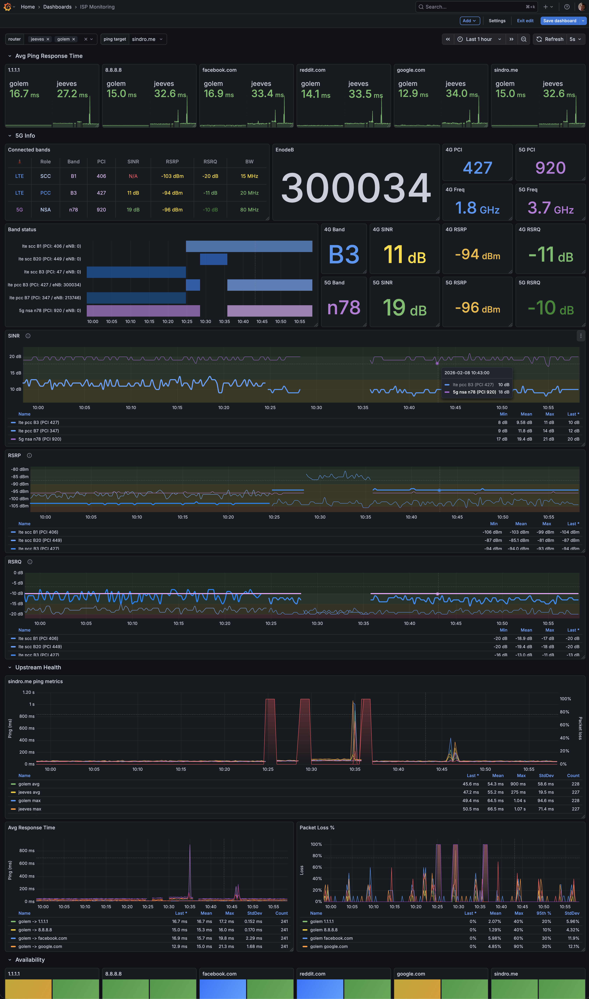

# quectel-5g-tools

[](https://opensource.org/licenses/MIT)
[](https://github.com/vjt/quectel-5g-tools/actions/workflows/ci.yml)
[](https://www.lua.org/)
[](https://openwrt.org/)
[](https://sindro.me/posts/2026-04-30-glinet-gl-x3000-vanilla-openwrt-25-12/)

Tools for monitoring, configuring, and *babysitting* Quectel 5G modems
on OpenWrt.

Originally developed for the GL.iNet GL-X3000 (Spitz AX) with the
Quectel RM520N-GL modem and a Poynting XPOL-24 directional antenna,
but the Lua/UCI plumbing isn't device-specific — anything OpenWrt
≥ 22.03 with an RM520N-class modem on `/dev/ttyUSB2` should work.

See [`vjt/openwrt-glinet-x3000`](https://github.com/vjt/openwrt-glinet-x3000)
for a vanilla OpenWrt 25.12 build with these tools baked in (grab the
latest [release](https://github.com/vjt/openwrt-glinet-x3000/releases)
and flash the sysupgrade bin), and
[*GL-X3000 on Vanilla OpenWrt 25.12: Every Pitfall, Documented*](https://sindro.me/posts/2026-04-30-glinet-gl-x3000-vanilla-openwrt-25-12/)
for the migration story.

## Features

- **5g-info** — one-shot CLI dump of modem state (table or JSON).
- **5g-monitor** — live TUI with colour-coded signal bars and audio
  feedback; useful when aiming a directional antenna.
- **5g-lock** — declarative band / cell locking driven from UCI.
- **5g-led-bars** — procd daemon driving the GL-X3000 panel LEDs from
  the strongest NR carrier's RSRP (falls back to LTE PCC when no NR).
- **5g-watchdog** — procd daemon that detects NSA 5G NR SCG drops via
  `mmcli` and forces a re-attach (`--disable`/`--enable`, with a
  `--set-allowed-modes` toggle as a fallback). Fills a gap that
  ModemManager doesn't cover: when the cell silently stops
  aggregating NR while the LTE master leg stays connected, throughput
  collapses to LTE-only; the watchdog drags the modem back onto NR.
- **at** — small AT-command wrapper.
- **Prometheus exporters** — two collectors for
  `prometheus-node-exporter-lua`: signal/cell metrics and watchdog
  state.

## Quick Start

If you already have a feed serving this package (e.g. via the
[openwrt-builder](https://github.com/vjt/openwrt-builder) flow):

```bash
# OpenWrt 25.12+ (apk)
apk update && apk add quectel-5g-tools
/etc/init.d/5g-led-bars enable && /etc/init.d/5g-led-bars start
/etc/init.d/5g-watchdog enable && /etc/init.d/5g-watchdog start

# OpenWrt ≤ 24.10 (opkg)
opkg update && opkg install quectel-5g-tools
```

Otherwise — try-it-out from the source tree:

```bash
opkg install luaposix          # or: apk add luaposix
git clone https://github.com/vjt/quectel-5g-tools.git
cd quectel-5g-tools
ln -s "$PWD/lua/quectel" /usr/lib/lua/quectel
./bin/5g-info
./bin/5g-monitor
```





## Installation

### Via package (recommended)

Build with [openwrt-builder](https://github.com/vjt/openwrt-builder)
or any OpenWrt SDK that points at `openwrt/quectel-5g-tools/Makefile`
in this repo. The package bakes in:

- the Lua library and CLI binaries
- both Prometheus collectors
- procd init scripts for `5g-led-bars` and `5g-watchdog`
- a UCI config skeleton at `/etc/config/quectel`
- a `mm-ignore-tty` list (see "ModemManager coexistence" below)

The package depends on `lua`, `luaposix`, `libuci-lua`, and
`modemmanager` (the watchdog drives the modem via `mmcli`).

### Manual install

```bash
# Install Lua library
rm -f /usr/lib/lua/quectel
cp -r lua/quectel /usr/lib/lua/

# Install CLI tools (rename `at` to `quectel-at` to avoid colliding
# with busybox's `at`)
cp bin/5g-info bin/5g-monitor bin/5g-led-bars bin/5g-watchdog \
   bin/5g-lock bin/modem-debug /usr/bin/
cp bin/at /usr/bin/quectel-at

# Install Prometheus collectors (optional)
cp lua/prometheus-collectors/*.lua /usr/lib/lua/prometheus-collectors/

# Install procd init scripts (optional, for the daemons)
cp etc/init.d/5g-led-bars etc/init.d/5g-watchdog /etc/init.d/
chmod +x /etc/init.d/5g-led-bars /etc/init.d/5g-watchdog

# Install UCI config (only the first time — preserves existing config
# on upgrades when shipped via package)
cp config/quectel.uci /etc/config/quectel
```

A ready to use Grafana dashboard (provided you have already set up metrics exporting to prometheus or victoriametrics) is [available here](https://grafana.com/grafana/dashboards/24835) (ID `24835`).

Obligatory screenshot:



## Usage

### 5g-info

Display modem information:

```bash
5g-info                    # Full info with colors
5g-info --json             # JSON output
5g-info --section serving  # Only serving cell
5g-info --no-color         # Plain text
```

### 5g-monitor

Real-time monitoring with ANSI TUI:

```bash
5g-monitor                 # Start monitor
5g-monitor --interval 2    # 2-second refresh
5g-monitor --no-beep       # Disable audio feedback
```

Press Ctrl+C to quit.

### Band and cell locking

Configure bands in UCI:

```bash
uci add_list quectel.modem.lte_bands='1'
uci add_list quectel.modem.lte_bands='3'
uci add_list quectel.modem.nr5g_bands='78'
uci commit quectel
```

Configure cell locks (optional, does not persist across reboots):

```bash
uci add_list quectel.modem.lte_cells='275,280'       # earfcn,pci
uci add_list quectel.modem.nr5g_cells='920,648768,15,78'  # pci,arfcn,scs,band
uci commit quectel
```

Then apply:

```bash
5g-lock                    # Show current lock status
5g-lock --apply            # Apply bands and cell locks from UCI config
5g-lock --reset            # Clear all band and cell locks
5g-lock --wait=30 --apply  # Wait 30s then apply (for boot scripts)
```

The `--apply` command is declarative: it makes the modem match the UCI config exactly. Bands or cell locks removed from the config will be cleared on the modem. Band locks persist across reboots; cell locks do not.

### AT commands

The wrapper installs as `quectel-at` (renamed to avoid colliding
with busybox's `at`):

```bash
quectel-at                          # Run default info commands
quectel-at ATI                      # Single command
quectel-at AT+CSQ 'AT+CREG?'        # Multiple commands
```

### 5g-led-bars

procd daemon that drives the GL-X3000 panel LEDs from the strongest
NR carrier's RSRP (falls back to LTE PCC RSRP when no NR is
attached). The init script reasserts the LEDs' kernel trigger to
`none` so the netdev trigger doesn't fight the daemon's brightness
writes.

Tunables in `/etc/config/quectel` under `config led_bars 'led_bars'`:

| Option | Default | Description |
|---|---|---|
| `enabled` | `1` | Master switch — set to `0` to keep the package installed but skip starting the daemon. |
| `interval` | `10` | Poll interval in seconds. The reads come from the same AT serial port the rest of the toolkit uses, so don't poll faster than `5g-monitor` would. |

### 5g-watchdog

procd daemon that detects NSA 5G NR Secondary Cell Group (SCG) drops
and forces the modem to re-attach. Targets a real failure mode on
the RM520N: the cell can stop adding the NR leg while the LTE master
stays connected, so the bearer keeps working but throughput collapses
to LTE-only. ModemManager has no policy hook for "I expected NSA
aggregation and didn't get it" — this daemon fills that gap.

Detection runs entirely off `mmcli -m N -K`; no AT serial contention,
nothing fights MM for ownership of the modem. Two-stage recovery:

1. `mmcli --disable` + `mmcli --enable` — NAS detach/attach.
   ~8s of dropout, MM redials the bearer transparently.
2. `mmcli --set-allowed-modes='4g'` then restore — RAT toggle that
   forces the modem firmware to drop and restart NR measurements.
   Only fires if stage 1 didn't bring NR back after the cooldown.

After two consecutive failed actions the daemon flags `capped=1` for
Prometheus and stops trying — at that point it's an RF coverage
issue, not something software can fix.

Tunables in `/etc/config/quectel` under `config watchdog 'watchdog'`:

| Option | Default | Description |
|---|---|---|
| `enabled` | `1` | Master switch. |
| `poll_interval` | `60` | Seconds between probes. |
| `degraded_samples` | `5` | Consecutive degraded probes (default = 5 min) required before action. NSA NR SCG flickers on the second timescale during mobility — a high hysteresis filters that out. |
| `cooldown` | `900` | Seconds after an action before the next action is allowed. Gives the cell time to re-add NR. |
| `daily_cap` | `6` | Hard cap of actions per 24 h window. If we hit it the problem isn't transient; alert and stop. |
| `enable_mode_toggle` | `1` | Allow stage 2 (mode toggle). Set to `0` to disable; only stage 1 will be tried. |

State is published every poll to `/var/run/5g-watchdog.state` (a flat
`key=value` file) — that's what the Prometheus collector reads. Logs
go to syslog (`logread | grep 5g-watchdog`) on every transition, plus
a heartbeat on each degraded sample so progress toward the threshold
is visible.

### ModemManager coexistence

When the package is installed alongside ModemManager (the default on
OpenWrt 25.12 with this toolkit's deps), `/etc/modemmanager/ignore-tty`
lists `/dev/ttyUSB0..3`, and a patched MM tty-hotplug script
(`/etc/hotplug.d/tty/25-modemmanager-tty`, shipped by the OpenWrt
fork at [vjt/openwrt](https://github.com/vjt/openwrt)) honours that
list. That keeps the four Quectel USB AT/DIAG/NMEA/AT2 ports out of
MM's hands so `5g-info`, `5g-monitor`, `5g-lock` and `5g-led-bars`
can drive them directly. MM still owns the WWAN net interface,
QMI/MBIM control channel, and bearer lifecycle.

`5g-watchdog` deliberately does *not* touch the AT bus — it uses
`mmcli` for both detection and recovery so it's MM-aware end to end.

## Prometheus Metrics

Install the collectors to `/usr/lib/lua/prometheus-collectors/`
(both `quectel.lua` and `quectel-watchdog.lua`) and they will be
picked up by `prometheus-node-exporter-lua` automatically.

### Signal & cell metrics (`quectel.lua`)

| Metric | Labels | Description |
|--------|--------|-------------|
| modem_cell_state | role, technology, band, pci, enodeb, cell_id | Connected cells (1=active) |
| modem_signal_rsrp_dbm | role, technology, band, pci | Signal strength |
| modem_signal_rsrq_db | role, technology, band, pci | Signal quality |
| modem_signal_sinr_db | role, technology, band, pci | SINR |
| modem_frequency_mhz | role, technology, band, pci | Carrier frequency |
| modem_bandwidth_mhz | role, technology, band, pci, direction | Bandwidth |

Label values:
- `role`: `pcc` (primary), `scc` (secondary), `nsa` (5G non-standalone)
- `technology`: `lte` or `5g`
- `band`: e.g., `B1`, `B3`, `n78`
- `direction`: `dl` (downlink) or `ul` (uplink)

### Watchdog metrics (`quectel-watchdog.lua`)

| Metric | Labels | Description |
|--------|--------|-------------|
| quectel_watchdog_nr_attached | — | 1 if NR is currently aggregated, 0 if SCG dropped. |
| quectel_watchdog_nr_capable | — | 1 if `5g` is in the modem's current allowed-modes (i.e., NR could be attached). |
| quectel_watchdog_connected | — | 1 if `mmcli` reports `state=connected`. |
| quectel_watchdog_consecutive_degraded_samples | — | Count of consecutive polls with NR missing. Resets on recovery. |
| quectel_watchdog_actions_total | stage=`disable_enable`\|`mode_toggle` | Cumulative recovery actions taken. |
| quectel_watchdog_actions_24h | — | Actions taken in the trailing 24 h window. Compare against `daily_cap`. |
| quectel_watchdog_last_action_timestamp_seconds | — | Unix ts of the most recent recovery action. |
| quectel_watchdog_cooldown_until_timestamp_seconds | — | Unix ts when the current cooldown expires. |
| quectel_watchdog_last_recovery_duration_seconds | — | Seconds between the last action and NR re-attaching (or `RECOVERY_MAX_WAIT+1` if it didn't). |
| quectel_watchdog_consecutive_failed_actions | — | How many recovery attempts in a row failed to re-attach NR. Drives stage escalation + cap. |
| quectel_watchdog_capped | — | 1 when the daemon has stopped acting until the 24 h window resets. Useful as a paging signal. |
| quectel_watchdog_updated_timestamp_seconds | — | Unix ts of the last state-file update — alert if it stops moving. |

Suggested alert rules:

- `quectel_watchdog_nr_attached == 0 for 10m` — NR has been gone
  long enough that the daemon should have acted.
- `quectel_watchdog_capped == 1` — daemon hit its daily cap and is
  no longer trying to recover; needs human attention.
- `time() - quectel_watchdog_updated_timestamp_seconds > 300` —
  watchdog daemon has stalled or crashed.

## Configuration

UCI config: `/etc/config/quectel`

```
config modem 'modem'
    option device '/dev/ttyUSB2'
    option timeout '2'
    option refresh_interval '5'
    option beeps_enabled '1'
    list lte_bands '1'
    list lte_bands '3'
    list lte_bands '7'
    list lte_bands '20'
    list nr5g_bands '78'
    # Cell locks (optional, do not persist across reboots)
    # list lte_cells '275,280'            # earfcn,pci
    # list nr5g_cells '920,648768,15,78'  # pci,arfcn,scs,band

config led_bars 'led_bars'
    option enabled '1'
    option interval '10'

config watchdog 'watchdog'
    option enabled '1'
    option poll_interval '60'
    option degraded_samples '5'
    option cooldown '900'
    option daily_cap '6'
    option enable_mode_toggle '1'
```

## Signal Quality Thresholds

| Metric | Excellent | Good | Fair | Poor |
|--------|-----------|------|------|------|
| RSRP   | > -80 dBm | > -90 dBm | > -100 dBm | < -100 dBm |
| RSRQ   | > -10 dB  | > -12 dB  | > -15 dB   | < -15 dB   |
| SINR   | > 20 dB   | > 13 dB   | > 0 dB     | < 0 dB     |

## Project Structure

```
.
├── lua/
│   ├── quectel/                       # Core Lua library
│   │   ├── init.lua                   # Main API and config loading
│   │   ├── modem.lua                  # Serial communication
│   │   ├── parser.lua                 # AT response parsing
│   │   ├── display.lua                # Terminal output formatting
│   │   ├── frequency.lua              # EARFCN/ARFCN → MHz conversion
│   │   ├── thresholds.lua             # Signal quality thresholds
│   │   ├── uci.lua                    # UCI accessor (libuci-lua)
│   │   └── utils.lua                  # Shared utilities (sleep, etc.)
│   └── prometheus-collectors/
│       ├── quectel.lua                # Signal/cell exporter
│       └── quectel-watchdog.lua       # Watchdog state exporter
├── bin/                               # Tools and daemons
│   ├── 5g-info                        # One-shot info display
│   ├── 5g-monitor                     # Real-time TUI monitor
│   ├── 5g-lock                        # Band and cell locking utility
│   ├── 5g-led-bars                    # GL-X3000 LED bars daemon
│   ├── 5g-watchdog                    # NSA NR SCG re-attach daemon
│   ├── at                             # AT command wrapper (→ quectel-at)
│   └── modem-debug                    # Debug info collection
├── etc/
│   ├── init.d/                        # procd init scripts (led-bars, watchdog)
│   └── uci-defaults/                  # First-boot UCI seed scripts
├── config/
│   ├── quectel.uci                    # UCI config template
│   └── mm-ignore-tty                  # Ports the patched MM should skip
├── tests/                             # Lua unit tests
├── doc/                               # Screenshots and reference PDFs
├── openwrt/quectel-5g-tools/          # OpenWrt package Makefile
└── legacy/                            # Python implementation (archived)
```

## Dependencies

- **lua**, **luaposix**, **libuci-lua** — runtime for the Lua tools.
- **modemmanager** — required by `5g-watchdog`; also the supported
  bearer manager on OpenWrt 25.12 (replaces `umbim` + the stock
  `wwan` watchdog).
- **prometheus-node-exporter-lua** — optional, for the two metric
  collectors.

## License

MIT
